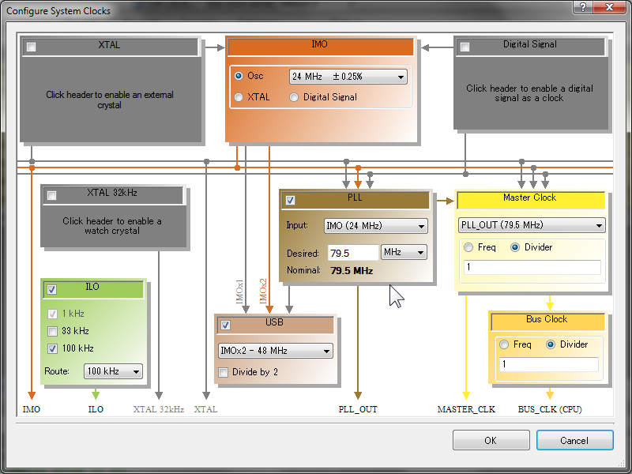
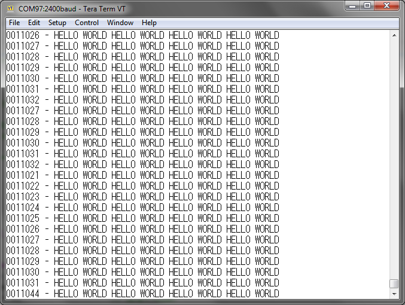
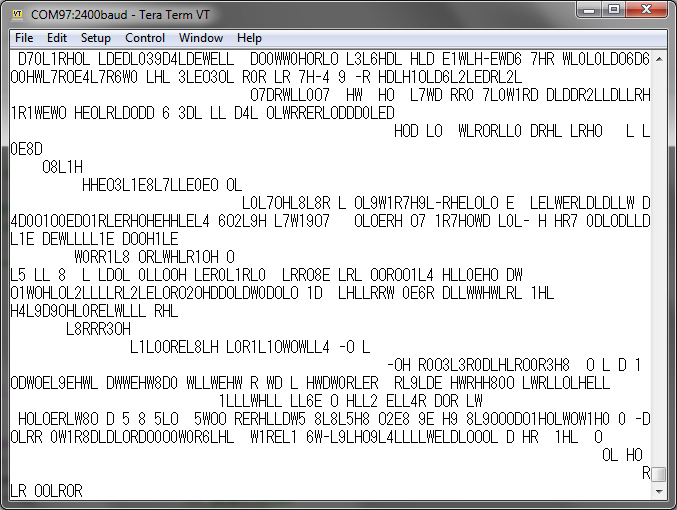

[Japanese]

The easy way to use the USB interface on the **PSoC 5LP** is to use a virtual COM port with the **USBUART** component.
However the  **USBUART** component does not have a First In First Out (**FIFO**) buffer like other serial components, for example UART, have.

In this article, a method is introduced to implement a **FIFO** used for the **USBUART** component.

## Implementing FIFO to USBUART TX on PSoC 5LP

At first a **TX** side implementation is introduced.


### A hard thing on USB

The **USBUART** component has a `PutChar()` method to send one byte to the host.
In this method, the firmware waits for the completion of the transmission at the TX endpoint and put one byte data to the TX endpoint buffer.
The one byte data will be sent to the host upon a host's request to get a packet from the USB function.
However the endpoint has a 64 byte buffer, only one byte of the buffer is used when the `PutChar()` method is called.

It is required to improve the data transfer throughput to put more data to the endpoint buffer as many as possible.
One idea to increase the throughput is to delay the endpoint packet transfer until the endpoint buffer is filled up.
But this method also increases the latency to send data.
For example if the USB function is going to send a 63 byte of data to the HOST, the data never sent to the host because the endpoint buffer is never filled up.

To prevent this issue, the **FIFO** designed in this article behaves as following concepts.

1. Fill a buffer with a data to be sent.
2. Monitor the buffer periodically and send the buffer if the buffer is available or required to be sent.

The most important factor is "the monitoring time period."
Base on the **USB** specification the **USB Full-Speed** protocol is divided into 1ms "frame" and the transactions are allocated to the "frame."
In this article, the monitoring time period is set to a half of "frame," 0.5ms to put one packet to a "frame" at least.
In particular the interrupt `int_uartQueue` is triggered by a 2kHz clock.


### Configuration of the clock



The **Internal Main Oscillator (IMO)** is adjusted by the timing clock generated from the **USB** bus signal.
With this method the **IMO** clock can be adjusted to 24MHz&plusmn;0.25%
A 79.5MHz clock is generated by the internal **PLL** to be used as the **BUS_CLK** which drives the CPU and other digital circuits.
This is the maximum frequency which is allowed by the system.


### Firmware

The firmware is described as follows.

```main.c
#include "project.h"

// Uncomment when Disable the FIFO function.
//#define NOFIFO
```

At the beginning of the `main.c` file, there is a commented **NOFIFO** macro definition following the `#include` line.
When this macro definition is enabled it is available to try a configuration without **FIFO**.

```main.c
// The packet size of the USBUART
// is used for the FIFO buffer size too.
#define     UART_TX_QUEUE_SIZE      (64)

// TX buffer declaration
uint8       uartTxQueue[UART_TX_QUEUE_SIZE];    // Queue buffer for TX
uint8       uartTxCount = 0;                    // Number of data bytes contained in the TX buffer
CYBIT       uartZlpRequired = 0;                // Flag to indicate the ZLP is required
uint8       uartTxReject = 0;                   // The count of trial rejected by the TX endpoint
```

The BULK packet size used in the **USBUART** component and other variables used in the **FIFO** are declared.
Because the **USBUART** component contains the configuration descriptor, the size must be get from that descriptor.
In this implementation the size is defined here because any nice idea are not found to get the packet size from the descriptor.
The data to be sent is stored into the buffer up to the packet size and sent through the **USBUART** component when required.

The `uartZlpRequired` flag (ZLP required flag) indicates if a "Zero Length Packet" (ZLP) is required to be sent.
The maximum packet size is 64 bytes to store data in the **USBUART** component.
When a **USB** device want to send a data which size is larger than 64 bytes, multiple 64 byte packets are sent following a "Short Packet" which packet size is smaller than 64 bytes.
The "Short Packet" indicates the end of data in this case.

When a data size is equal to the multiple of 64 bytes, all packet size will be 64 bytes and it is not impossible to indicate the end of data.
In this case, ZLP is used to indicate the end of data.
The "ZLP required flag" is asserted when the last sent packet size is 64 bytes to indicate that it is required to send a ZLP as the next packet.

When the data in the buffer is sent as a **USB** packet, the packet transmission will be postponed if the **USBUART** component is not ready to accept.
When a packet to be sent is postponed many times, the application which is going to sent the data will be stuck.
Preventing this situation, the number of postponing is counted in the variable  `uartTxRejecte` and the **FIFO** gave up to send the packet and discard the packet when the postponed count reaches to a specified number to prevent from the application stuck.

```main.c
#ifdef NOFIFO
    
// Function to send one byte to USBUART
static void putch_sub(const int16 ch) {
    // PutChar() function is used if no FIFO used
    USBUART_PutChar(ch);
}
```

The function `USBUART_PutChar()` is used to send a byte data when the **FIFO** is not used.

```main.c
#else // define(NOFIFO)

// Function to send one byte to USBUART
static void putch_sub(const int16 ch) {
    uint8 state;
    for (;;) {
        // Wait until the TX buffer is EMPTY
        state = CyEnterCriticalSection();
        if (uartTxCount < UART_TX_QUEUE_SIZE) break;
        CyExitCriticalSection(state);
    }
    // Store one byte into the TX buffer
    uartTxQueue[uartTxCount++] = ch;
    CyExitCriticalSection(state);
}
```

On the other hand, the byte data is pushed into the TX buffer when the **FIFO** is used.
When the TX buffer is **FULL** the application wait until the TX buffer has free area in this function.

When a periodic interrupt is occurred and a packet is sent in the interrupt service routine, the TX buffer will be EMPTY.
This means that it is expected to have an interrupt event during executing this function and it is possible that the variables used for **FIFO** are accidentally modified.

To prevent from such accidents the variables are protected by declaring a "Critical Section" preventing from other programs' interruptions.
The "Critical Section" is created by two functions `CyEnterCriticalSection()` and `CyExitCriticalSection()` to prohibit interrupts safely.

```main.c
// TX side Interrupt Service Routine
void uartTxIsr(void) {
    uint8 state = CyEnterCriticalSection();
    if ((uartTxCount > 0) || uartZlpRequired) {
        // Send a packet if the TX buffer has any data or an ZLP packet is required.
        if (USBUART_CDCIsReady()) {
            // Send a packet if the USBUART accepted.
            USBUART_PutData(uartTxQueue, uartTxCount);
            // Clear the buffer
            uartZlpRequired = (uartTxCount == UART_TX_QUEUE_SIZE);
            uartTxCount = 0;
            uartTxReject = 0;
        } else if (++uartTxReject > 4) {
            // Discard the TX buffer content if USBUART does not accept four times.
            uartTxCount = 0;
            uartTxReject = 0;
        } else {
            // Expect next time
        }
    }
    CyExitCriticalSection(state);
}

#endif // define(NOFIFO)
```

A **USB** packet is sent to the host in the periodic interrupt service routine `uartTxIsr()`.
There is a "Critical Section" in this routine too.
This is because the data transmission function may be called from another interrupt service routine with an higher interrupt priority.

The condition when a packet is sent is there is any byte of data in the buffer and/or the "ZLP required flag" is asserted.
The contents of the buffer is sent to the host when the **USBUART** component is ready to send a packet.
If the **USBUART** component rejects the packet, the "uartTxRejected" counter is incremented and the packet is discarded if the counter reaches to the specified number.

```main.c
// Send one character to USBUART
void putch(const int16 ch) {
    if (ch == '\n') {
        // Convert LF to CRLF
        putch_sub('\r');
    }
    putch_sub(ch);
}
```

The application calls the function `putch()` to send a one character to the host.
There is a process to convert a **LF** character to a sequence of **CR** and **LF** in this function.

```main.c
// Send a character string to USBUART
void putstr(const char *s) {
    // Send characters to the end of line
    while (*s) {
        putch(*s++);
    }
}

// 32-bit power of ten table
static const uint32 CYCODE pow10_32[] = {
    0L,
    1L,
    10L,
    100L,
    1000L,
    10000L,
    100000L,
    1000000L,
    10000000L,
    100000000L,
    1000000000L,
};

// Show 32-bit decimal value
// Not supporting ZERO SUPPRESS feature.
void putdec32(uint32 num, const uint8 nDigits) {
    uint8       i;
    uint8       k;
    CYBIT       show = 0;

    // Number of digits to be shown
    i = sizeof pow10_32 / sizeof pow10_32[0];
    while (--i > 0) {             // Show until last digit
        // Get the i-th digit value
        for (k = 0; num >= pow10_32[i]; k++) {
            num -= pow10_32[i];
        }
        // Specify if the digit should be shown or not.
        show = show || (i <= nDigits) || (k != 0);
        // Show the digit if required.
        if (show) {
            putch(k + '0');
        }
    }
}
```

There are string output utility functions `putstr()` to send a null terminated string and `putdec32()` to convert a 32 bit value into a decimal number format string.

```main.c
#ifndef NOFIFO
    
// Periodically check the TX and RX of USBUART
CY_ISR(int_uartQueue_isr) {
    uartTxIsr();
}

#endif // !define(NOFIFO)
```

An interrupt service routine is declared when the **FIFO** is used.
The TX buffer processing routine `uartTxIsr()` is called from this routine.

```main.c
int main(void) {
    uint32 nLine = 0;           // Line number
    
    CyGlobalIntEnable;                          // Enable interrupts    
    USBUART_Start(0, USBUART_5V_OPERATION);     // Initialize USBFS using 5V power supply

#ifndef NOFIFO
    
    int_uartQueue_StartEx(int_uartQueue_isr);   // Initialize the periodic timer

#endif // !define(NOFIFO)

    for(;;) {
        // Wait for initialization completed
        while (USBUART_GetConfiguration() == 0);

        USBUART_IsConfigurationChanged();       // Ensure to clear the CHANGE flag
        USBUART_CDC_Init();                     // Initialize the CDC feature

        for (;;) {
            // Re-initialize if the configuration is changed
            if (USBUART_IsConfigurationChanged()) {
                break;
            }

            // CDC-IN : Send a message to the HOST
            putdec32(nLine++, 7);
            putstr(" - HELLO WORLD HELLO WORLD HELLO WORLD HELLO WORLD\n");
            
            // CDC-Control : Ignore all control commands
            (void)USBUART_IsLineChanged();
        }
    }
}
```

In the `main()` function, after the **USBFS** component is initialized the program enters to the main loop.
The main loop consists of a double structure.
An configuration request is waited in the outer loop.
In the inner loop, there are disconnection request from the host, the procedure of the application, and the control commend procedure for the **CDC** device.

In the application procedure, a 59 byte of "HELLO WORLD" strings are sent to the host forever.
The string has a line number at the beginning of each line to identify the line number of each line.


### Execution



After building and programming the project, the project is executed.
The **PSoC 5LP** is connected to a PC using a **USB** cable and a terminal software is executed on the PC.
The terminal software shows many lines like this screen shot.

A 59 bytes of data is sent to the host when a line is shown.
It take 43 seconds to send 100,000 lines.
The effective throughput is calculated as 134kiB/s.

The throughput can be increased when decrease the period of the periodic interrupt.
It is recommended to specify the periodic interrupt period according to the required data rate.


### When no FIFO used



When the macro **NOFIFO** is defined, the behavior is confirmed when the **FIFO** is not used.
The output is destroyed.
It was found that the **USBUART** interface cannot be used in the higher throughput case. 


[japanese]:./README-ja.md
[PSoC Advent Calendar 2016]:https://www.adventar.org/calendars/1796
[GitHub Repository]:https://github.com/noritan/Design307
