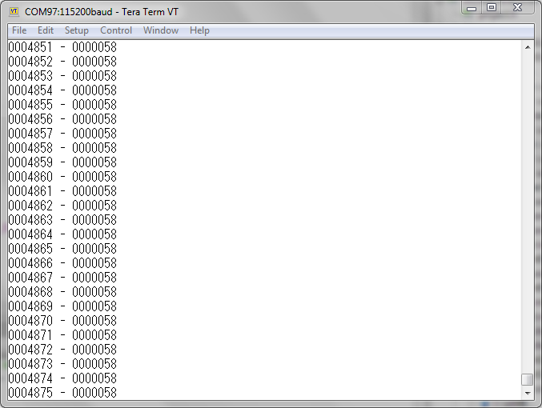

# USBUARTにFIFOを装備する

[PSoC Advent Calendar 2016]の12日目と19日目の合併記事です。

**PSoC 5LP**のUSBインターフェイスを使うには、**USBUART**コンポーネントを使った仮想COMポートを利用するのが簡単です。
ところが、**USBUART**コンポーネントは、**UART**など他のシリアルインターフェイスが持っているような**FIFO**を持っていません。

この記事では、**USBUART**で**FIFO**を使う方法をご紹介します。

## USBUARTのTXにFIFOを装備する

まずは、**TX**側に**FIFO**を装備します。


### USBのややこしい所

**USBUART**には、1バイトのデータを送るための`PutChar()` メソッドが定義されています。
このメソッドを使うと、エンドポイントの送信が終わったのを確認してから、エンドポイントバッファに1バイトのデータを入れます。
そして、ホストから取り込み要求が来た時にバッファのデータを送信します。
エンドポイントバッファは64バイトの大きさがあるのですが、`PutChar()` メソッドを呼び出した時には1バイトしか使われません。

データ送信のスループットを上げるためには、64バイトのバッファになるべく多くのデータを入れなくてはなりません。
そこで考えられるのが、64バイトのデータが貯まるまで送信を遅らせる方法ですが、この方法ではデータが先方に届くまでの遅延時間が大きくなってしまいます。
例えば、63バイトのデータを送りたい場合、永遠にバッファがいっぱいにならないために全くデータが送りだされないという状態も起こりえます。

このような事態を防ぐため、ここで作成する**FIFO**では、以下の方針を取り入れました。

1. 送りたいデータは、バッファに積んでおく。
2. 周期的にバッファを監視して、送信可能な状態であればバッファからデータを送信する。

ここで重要になるのは、「バッファの監視周期」です。
**USB Full-Speed**規格の転送は、1ミリ秒の「フレーム」と呼ばれる時間単位で区切られており、このフレームにパケットを詰めます。
ここでは、ひとつのフレームに必ずひとつ以上のパケットを入れられるように監視周期をフレームの半分の時間0.5ミリ秒に設定しています。
具体的には、2kHzのクロックにより割り込み`int_uartQueue`を発行しています。


### クロックの設定


クロックは、**USB**バスからクロック成分を取り出して **Internal Main Oscillator (IMO)** の周波数を微調整する方式を採用しています。
これにより、**IMO**の周波数を"24MHz&plusmn;0.25%"まで追い込むことができます。
"79.5MHz"のクロックを**PLL**により生成し、CPU等を駆動するためのクロック**BUS_CLK**として使用しています。
これがシステムで使用可能な最大周波数です。


### ファームウェア

ファームウェアは、以下のようになりました。

```c:main.c
#include "project.h"

// Uncomment when Disable the FIFO function.
//#define NOFIFO
```

冒頭、 include に続いてコメントアウトされた**NOFIFO**マクロ宣言があります。
このマクロを有効にすると、**FIFO**を使わない設定も試す事ができます。

```c:main.c
// The packet size of the USBUART
// is used for the FIFO buffer size too.
#define     UART_TX_QUEUE_SIZE      (64)

// TX buffer declaration
uint8       uartTxQueue[UART_TX_QUEUE_SIZE];    // Queue buffer for TX
uint8       uartTxCount = 0;                    // Number of data bytes contained in the TX buffer
CYBIT       uartZlpRequired = 0;                // Flag to indicate the ZLP is required
uint8       uartTxReject = 0;                   // The count of trial rejected by the TX endpoint
```

**USBUART**で使用するBULKパケットのサイズと**FIFO**で使用する変数を宣言しています。
**USBUART**コンポーネントには、ディスクリプタが含まれているのだから、パケットのサイズぐらい引っ張り出せそうなものなのですが、適当な方法が見つからなかったので、再定義しています。
このパケットサイズを上限としてバッファにデータを貯めておき、頃合いを見計らって**USBUART**コンポーネントから送り出します。

`uartZlpRequired` フラグ（要ZLPフラグ）は、"Zero Length Packet" （ZLP: 長さゼロのパケット）が必要な状況であるかどうかを示します。
**USBUART**でデータを格納するパケットの最大サイズは64バイトです。
この大きさを超えるデータを送りたい場合、複数の64バイトパケットに続いて64バイト未満のパケット（Short Packet: ショートパケット）を送り出します
。このショートパケットでデータの終端を表します。

ところが、64バイトの倍数の長さのデータを送る場合は、すべてのパケットのサイズが64バイトなので、データの終端が見分けられません。
このような場合、データの終端を表すために使用されるのがZLPです。
「要ZLPフラグ」は、データの最後のパケットが64バイトであった場合にセットされ、次のパケットでZLPを送信する必要があるかどうかを判断します。

バッファに貯まったデータを**USB**パケットとして送信する時、**USBUART**コンポーネントの受け入れ準備が出来ていなければ、次の機会を待つことになります。
このような後回しの状態が続くとデータを送信しようとしているアプリケーション側の処理が滞ってしまいます。
この例では、処理の停滞を防ぐために、受け入れを拒否された回数を`uartTxReject`で数えておき、何度も受け入れを拒否された場合にはバッファのデータを廃棄して送信をあきらめて処理を先に進ませるようにしています。

```c:main.c
#ifdef NOFIFO
    
// Function to send one byte to USBUART
static void putch_sub(const int16 ch) {
    // PutChar() function is used if no FIFO used
    USBUART_PutChar(ch);
}
```
**FIFO**を使わない場合、1バイトのデータを送るには`USBUART_PutChar()` 関数を使います。

```c:main.c
#else // define(NOFIFO)

// Function to send one byte to USBUART
static void putch_sub(const int16 ch) {
    uint8 state;
    for (;;) {
        // Wait until the TX buffer is EMPTY
        state = CyEnterCriticalSection();
        if (uartTxCount < UART_TX_QUEUE_SIZE) break;
        CyExitCriticalSection(state);
    }
    // Store one byte into the TX buffer
    uartTxQueue[uartTxCount++] = ch;
    CyExitCriticalSection(state);
}
```

一方、**FIFO**を使う場合には、送信キューに文字を積んでいきます。
もし、送信キューに空きが無かったら、空きが出来るまで待ちます。

送信キューに空きができるのは、周期割り込みによりバッファを送り出した時です。
つまり、この関数の実行中には割り込みがかかる事が期待されており、タイミングによっては、送信キューを構成する変数などが意図せず書き換えられる可能性があります。

このような事態を防ぐためには、"Critical Section"（きわどい領域）という他のプログラムの介入を禁止する区間をつくって、変数などを保護してやります。
この Critical Section を確保するための関数が`CyEnterCriticalSection()` と`CyExitCriticalSection()` です。
これらの関数を使う事で、安全に割り込みを禁止する事ができます。

```c:main.c
// TX side Interrupt Service Routine
void uartTxIsr(void) {
    uint8 state = CyEnterCriticalSection();
    if ((uartTxCount > 0) || uartZlpRequired) {
        // Send a packet if the TX buffer has any data or an ZLP packet is required.
        if (USBUART_CDCIsReady()) {
            // Send a packet if the USBUART accepted.
            USBUART_PutData(uartTxQueue, uartTxCount);
            // Clear the buffer
            uartZlpRequired = (uartTxCount == UART_TX_QUEUE_SIZE);
            uartTxCount = 0;
            uartTxReject = 0;
        } else if (++uartTxReject > 4) {
            // Discard the TX buffer content if USBUART does not accept four times.
            uartTxCount = 0;
            uartTxReject = 0;
        } else {
            // Expect next time
        }
    }
    CyExitCriticalSection(state);
}

#endif // define(NOFIFO)
```

周期割り込みの処理ルーチンでは、**USB**のパケットを送信しています。
この処理も"Critical Section"に入れてあります。
これは、周期割り込みよりも優先順位の高い割り込みからデータ送信関数が呼ばれる場合を想定したものです。

パケットを送信する条件は、バッファにデータが入っているかまたは「要ZLPフラグ」がセットされている事です。
**USBUART**からの送信が受け入れ可能な場合にはバッファの中身を送信します。
**USBUART**が送信を拒否した場合には`uartTxReject` をインクリメントし、規定の回数以上拒否されていたらパケットを破棄します。

```c:main.c
// Send one character to USBUART
void putch(const int16 ch) {
    if (ch == '\n') {
        // Convert LF to CRLF
        putch_sub('\r');
    }
    putch_sub(ch);
}
```

実際にアプリケーションから呼ばれる一文字送信関数は、`putch()` です。
この関数の中では、**LF**を**CRLF**に変換する処理が入っています。

```c:main.c
// Send a character string to USBUART
void putstr(const char *s) {
    // Send characters to the end of line
    while (*s) {
        putch(*s++);
    }
}

// 32-bit power of ten table
static const uint32 CYCODE pow10_32[] = {
    0L,
    1L,
    10L,
    100L,
    1000L,
    10000L,
    100000L,
    1000000L,
    10000000L,
    100000000L,
    1000000000L,
};

// Show 32-bit decimal value
// Not supporting ZERO SUPPRESS feature.
void putdec32(uint32 num, const uint8 nDigits) {
    uint8       i;
    uint8       k;
    CYBIT       show = 0;

    // Number of digits to be shown
    i = sizeof pow10_32 / sizeof pow10_32[0];
    while (--i > 0) {             // Show until last digit
        // Get the i-th digit value
        for (k = 0; num >= pow10_32[i]; k++) {
            num -= pow10_32[i];
        }
        // Specify if the digit should be shown or not.
        show = show || (i <= nDigits) || (k != 0);
        // Show the digit if required.
        if (show) {
            putch(k + '0');
        }
    }
}
```

出力処理を行うユーティリティ関数として、文字列を出力する`putstr()` と十進数を表示する`putdec32()` を用意しました。

```c:main.c
#ifndef NOFIFO
    
// Periodically check the TX and RX of USBUART
CY_ISR(int_uartQueue_isr) {
    uartTxIsr();
}

#endif // !define(NOFIFO)
```

**FIFO**を使う場合に使用される割り込み処理ルーチンが定義されます。
この中から送信バッファの処理ルーチンを呼び出します。

```c:main.c
int main(void) {
    uint32 nLine = 0;           // Line number
    
    CyGlobalIntEnable;                          // Enable interrupts    
    USBUART_Start(0, USBUART_5V_OPERATION);     // Initialize USBFS using 5V power supply

#ifndef NOFIFO
    
    int_uartQueue_StartEx(int_uartQueue_isr);   // Initialize the periodic timer

#endif // !define(NOFIFO)

    for(;;) {
        // Wait for initialization completed
        while (USBUART_GetConfiguration() == 0);

        USBUART_IsConfigurationChanged();       // Ensure to clear the CHANGE flag
        USBUART_CDC_Init();                     // Initialize the CDC feature

        for (;;) {
            // Re-initialize if the configuration is changed
            if (USBUART_IsConfigurationChanged()) {
                break;
            }

            // CDC-IN : Send a message to the HOST
            putdec32(nLine++, 7);
            putstr(" - HELLO WORLD HELLO WORLD HELLO WORLD HELLO WORLD\n");
            
            // CDC-Control : Ignore all control commands
            (void)USBUART_IsLineChanged();
        }
    }
}
```

**USBFS**コンポーネントの初期化が終わったら、メインループに入ります。
メインループは、二重構造になっていて、外側のループではホストからの接続要求を待っています。
内側のループでは、ホストからの切断要求、アプリケーションの処理、そして**CDC**デバイスの制御コマンドの処理を行っています。

アプリケーションとして行っているのは、全体で59バイトの"HELLO WORLD"文字列を永遠に出力し続ける処理です。
このとき、先頭に行番号を追加しているので、何番目の出力なのかがわかるようになっています。


### 実行してみたら


プロジェクトが出来たら、実行してみます。
**PSoC 5LP**を**USB**ケーブルを介してPCに接続し、ターミナルソフトを接続すると、このスクリーンショットのように、文字列が延々と表示されます。

一行表示するごとに59バイトのデータが送信されていることになります。
10万行の送信を行った時に必要な時間を測定したところ、43秒かかりました。
ここから、実効スループットは134kiB/sと計算されました。

周期割り込みの周期を短くすると、スループットは上がりました。
送信するデータの量にしたがって、割り込み周期を決めてやるとよいでしょう。


### FIFO を使わなかったら


マクロ**NOFIFO**を使って、**FIFO**を使わない場合の動作も確認しました。
すると、表示が乱れて使い物になりません。
どこに問題が有るのか究明はしていませんが、スループットが高い場合には**FIFO**を入れないと話にならないという事がわかりました。


## USBUARTのRXにFIFOを装備する

次は、**RX**側にも**FIFO**を実装します。

### RX側FIFOの考え方

**RX**側の**FIFO**も**TX**側と同じ考え方で実装します。

1. 周期的にエンドポイントを監視して、データが届いていたらバッファが空である事を確認してバッファにデータを取り込む。
2. 一文字取り出し関数でバッファから文字を取り出す。

実は、この動作そのものは**FIFO**を使う場合でも使わない場合でも同じです。
これは、エンドポイントに貯まったデータを一文字ずつ取り出す方法がないために、すべてのデータを取り出さなくてはならないためです。

エンドポイントの監視周期は、**TX**側と同じ2kHzの割り込みを使います。


### ファームウェア

回路図およびコンポーネントの設定は、前回と同様です。
ファームウェアは、以下のようになりました。

```main.c
#include "project.h"

// Uncomment when Disable the FIFO function.
//#define NOFIFO

// The packet size of the USBUART
// is used for the FIFO buffer size too.
#define     UART_TX_QUEUE_SIZE      (64)
#define     UART_RX_QUEUE_SIZE      (64)
```

冒頭の部分には、受信で使うパケットのサイズ定義が追加されています。
送信の場合と同じように、**USBUART**が使用する**BULK**パケットのサイズをそのまま**FIFO**バッファのサイズとしています。

```main.c
// TX buffer declaration
uint8       uartTxQueue[UART_TX_QUEUE_SIZE];    // Queue buffer for TX
uint8       uartTxCount = 0;                    // Number of data bytes contained in the TX buffer
CYBIT       uartZlpRequired = 0;                // Flag to indicate the ZLP is required
uint8       uartTxReject = 0;                   // The count of trial rejected by the TX endpoint

// RX buffer declaration
uint8       uartRxQueue[UART_RX_QUEUE_SIZE];    // Queue buffer for RX
uint8       uartRxCount = 0;                    // Number of data bytes contained in the TX buffer
uint8       uartRxIndex = 0;                    // Index on RX buffer to get a byte
CYBIT       uartRxCRDetect = 0;                 // CR detection flag
```

送信の時に定義した送信バッファの定義の後、受信バッファの定義が続きます。
受信の場合だけに宣言されている`uartRxCRDetect`は、行末記号として**CR**を受信した場合にセットされます。
行末記号として**CR**+**LF**を受信した場合、このフラグがセットされた状態で**LF**を受信する事になります。
このようなときには、**CR**が送られてきた時に行末符号を返して、次の**LF**を無視しています。

この後、送信に関する記述が続きますが、ここでは、省略します。

```main.c
#ifdef NOFIFO

// Functio to receive one byte
int16 getch_sub(void) {
    int16 ch = -1;
    uint8 state = CyEnterCriticalSection();

    if (uartRxIndex >= uartRxCount) {
        // RX buffer is empty
        if (USBUART_DataIsReady()) {
            // and data arrives at USBUART
            // receive data to RX buffer
            uartRxCount = USBUART_GetAll(uartRxQueue);
            uartRxIndex = 0;
        }
    }
    if (uartRxIndex < uartRxCount) {
        // If any characters left in RX buffer
        // get a byte from RX buffer
        ch = uartRxQueue[uartRxIndex++];
    }
    CyExitCriticalSection(state);
    return ch;
}
```

**FIFO**を使わない場合、この関数が１バイトの受信に使用されます。
前半では、受信バッファに確実にデータを準備しています。
具体的には、受信バッファが空の場合に限りエンドポイントからデータをバッファに取り出しています。

後半では、受信バッファから１バイトのデータを取り出して、関数の返り値としています。

この関数を使用した場合、次のパケットをこの関数の中で受け取るために、文字が受信されるまで処理が止まってしまう可能性が有ります。

```main.c
#else // define(NOFIFO)

// RX side Interrupt Service Routine
void uartRxIsr(void) {
    uint8 state = CyEnterCriticalSection();
    if (uartRxIndex >= uartRxCount) {
        // If RX buffer is EMPTY
        if (USBUART_DataIsReady()) {
            // and data arrives at USBUART
            // receive data to RX buffer
            uartRxCount = USBUART_GetAll(uartRxQueue);
            uartRxIndex = 0;
        }
    }
    CyExitCriticalSection(state);
}
```

これに対して、**FIFO**を使う場合には、エンドポイントからデータを取り出す前半部分を周期割り込みで処理して、後半部分をメインループ内で処理しています。
この割り込みサービスルーチンも、"Critical Section"をつくって、他の割り込みの介入を排除しています。

```main.c
// Function to get one byte from USBUART
int16 getch_sub(void) {
    int16 ch = -1;
    uint8 state = CyEnterCriticalSection();
    
    if (uartRxIndex < uartRxCount) {
        // If any characters left in RX buffer
        // get a byte from RX buffer
        ch = uartRxQueue[uartRxIndex++];
    }
    CyExitCriticalSection(state);
    return ch;
}

#endif // define(NOFIFO)
```

後半部分は、１バイト受信関数に記述されています。
受信バッファからデータを取り出すだけの簡単な構成です。

```main.c
// Get one character from USBUART
int16 getch(void) {
    int16 ch = getch_sub();
    if (uartRxCRDetect && ch == '\n') {
        uartRxCRDetect = 0;
        ch = getch_sub();
    } else if (ch == '\r') {
        ch = '\n';
        uartRxCRDetect = 1;
    }
    return ch;
}
```

実際に一文字を返す関数では、行末記号の処理を行っています。
この処理により、行末が**CR**、**LF**、**CR**+**LF**のいずれであっても、'\n'を返す事ができます。

```main.c
#ifndef NOFIFO
    
// Periodically check the TX and RX of USBUART
CY_ISR(int_uartQueue_isr) {
    uartTxIsr();
    uartRxIsr();
}

#endif // !define(NOFIFO)
```

割り込み処理ルーチンには、送信処理に使われていた関数に加えて受信処理に使われる関数が追加されました。

```main.c
int main(void) {
    uint32 nLine = 0;           // Line number
    uint32 nChars = 0;          // Number of characters
    
    CyGlobalIntEnable;                          // Enable interrupts
    USBUART_Start(0, USBUART_5V_OPERATION);     // Initialize USBFS using 5V power supply

#ifndef NOFIFO
    
    int_uartQueue_StartEx(int_uartQueue_isr);   // Initialize the periodic timer

#endif // !define(NOFIFO)

    for(;;) {
        // Wait for initialization completed
        while (USBUART_GetConfiguration() == 0);

        USBUART_IsConfigurationChanged();       // Ensure to clear the CHANGE flag
        USBUART_CDC_Init();                     // Initialize the CDC feature

        for (;;) {
            // Re-initialize if the configuration is changed
            if (USBUART_IsConfigurationChanged()) {
                break;
            }

            // CDC-OUT : Show the number of characters in a received line.
            {
                int16 ch = getch();
                if (ch >= 0) {
                    nChars++;
                    if (ch == '\n') {
                        putdec32(nLine, 7);
                        putstr(" - ");
                        putdec32(nChars, 7);
                        putstr("\n");
                        nLine++;
                        nChars = 0;
                    }
                }
            }
            
            // CDC-Control : Ignore all control commands
            (void)USBUART_IsLineChanged();
        }
    }
}
```

メインループにこのアプリケーションの処理が記述されています。
このアプリケーションでは、受信したデータの行ごとに文字数を数えて、行番号と文字数を送信します。
文字数を見る事で受信データに抜けや重複が無いかを確認し、行番号を見る事で受信したデータ量を求めることができます。


### 実行してみた



プロジェクトが出来たので実行してみました。
**TeraTerm**から一行59文字の巨大なテキストファイルを送り込んでみました。
行末が**CR**+**LF**になっているため、出力に表示される一行当たりの文字数は58バイトになっています。

10万行のデータを送って所要時間を測定したところ、98秒かかりました。実効スループットは59kiB/sと計算できます。


## FIFOを使わなかったら


**FIFO**を使わない設定も試してみましたが、やはりボロボロになってしまいました。
送信側がうまく働いていないのだから、あたりまえと言えばあたりまえですが。


[PSoC Advent Calendar 2016]:https://www.adventar.org/calendars/1796
[GitHub Repository]:https://github.com/noritan/Design307
